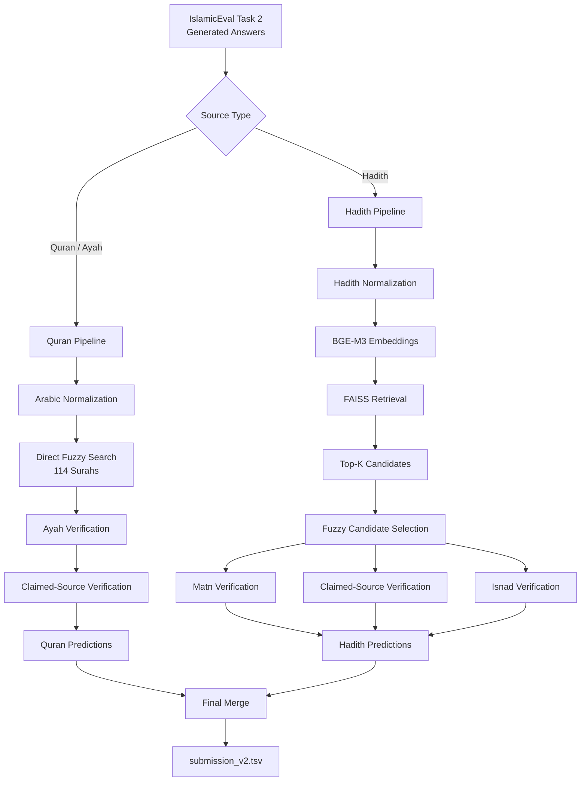

# IslamicEval 2026 — Task 2

## Hallucination Detection for Quranic Ayahs and Hadiths

This repository contains the **IslamicEval 2026 Task 2** implementation.

The code is organized into three executable stages:

1. **Quran / Ayah + its claimed source  pipeline**
2. **Hadith + its claimed source pipeline**
3. **Final prediction merge**

The two source families use different verification strategies:

* **Quran:** direct fuzzy matching against the 114-surah Quran database. No FAISS or embedding retrieval is used.
* **Hadith:** BGE-M3 semantic retrieval with FAISS, followed by fuzzy candidate selection and separate Matn, claimed-source, and Isnad verification.

---

## Architecture



---

# Usage

## 1. Installation

Create the environment and install dependencies:

```bash
python -m venv .venv
source .venv/bin/activate

pip install -e .
```

Update the dataset and model paths in:

```text
configs/config.yaml
```

---

## 2. Run the Quran / Ayah Pipeline

Run:

```bash
python scripts/run_ayah.py
```

The pipeline performs:

```text
Input annotations
       ↓
Quran database loading
       ↓
Arabic normalization
       ↓
Fuzzy search over 114 Surahs
       ↓
Ayah verification
       ↓
Claimed-source verification
       ↓
Evaluation
       ↓
Quran predictions
```

### Expected output

```text
outputs/quran_v2_combined_semanticScore_entityScore_fuzzyScore.tsv
```

The prediction file contains:

```text
Response_ID
Annotation_ID
Segment_Type
Label
```

---

## 3. Run the Hadith Pipeline

Run:

```bash
python scripts/run_hadith.py
```

The pipeline performs:

```text
Hadith corpus loading (34994 hadith)
       ↓
BGE-M3 embedding retrieval
       ↓
FAISS Top-K retrieval
       ↓
Fuzzy candidate selection
       ↓
Matn verification
       ↓
Claimed-source verification
       ↓
Isnad verification
       ↓
Threshold-based prediction
       ↓
Evaluation
       ↓
Hadith predictions
```

### Expected output

```text
outputs/hadith_combined_semanticScore_entityScore_fuzzyScore.tsv
```

The prediction file contains:

```text
Response_ID
Annotation_ID
Segment_Type
Label
```

---

## 4. Find Hadith Thresholds

The original implementation includes a grid search for the optimal semantic/fuzzy
combination.

Run:

```bash
python scripts/find_best_hadith_thresholds.py
```

The search is performed independently for:

```text
Matn
Claimed Source
Isnad
```

using the existing score data.

The selected configurations are preserved in:

```text
experiments/selected_hadith_thresholds.yaml
```

---

## 5. Merge Predictions

After both pipelines have completed, run:

```bash
python scripts/merge_predictions.py
```

The merge:

1. Loads Quran predictions.
2. Loads Hadith predictions.
3. Concatenates both files.
4. Sorts by `Response_ID` and `Annotation_ID`.
5. Writes the final submission.

### Expected output

```text
outputs/submission_v2.tsv
```

Final schema:

```text
Response_ID    Annotation_ID    Segment_Type    Label
```

---

## End-to-End Execution

The complete workflow is:

```bash
# 1. Quran / Ayah
python scripts/run_ayah.py

# 2. Hadith
python scripts/run_hadith.py

# 3. Optional: reproduce Hadith threshold search
python scripts/find_best_hadith_thresholds.py

# 4. Final submission
python scripts/merge_predictions.py
```

Final submission:

```text
outputs/submission_v2.tsv
```
